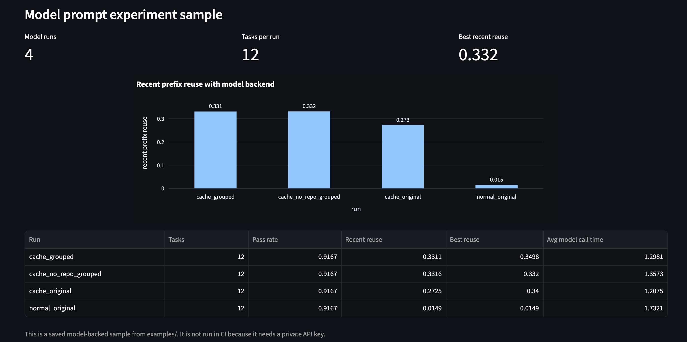

# Cache-Aware Coding Agent Benchmark

This is an early benchmark project around coding-agent inference.

The basic idea is that coding agents usually send a lot of repeated text across calls: system instructions, output rules, repo context, tool format, and task setup. If the repeated part of the prompt is kept near the front, the workload should be more friendly to prefix caching and KV-cache reuse.

Right now, this repo is not trying to claim a final serving result. It is a working prototype for testing the benchmark pipeline, prompt layouts, task ordering, repair traces, and model-backed sample runs.

## Prototype status

This repo is currently a presentable v1 prototype.

It has a CI-safe rule-baseline pipeline, a 12-task benchmark set, saved hosted-model samples, a Streamlit dashboard, task metadata, current results, and methodology notes.

The repo now has a basic local-backend setup for vLLM and SGLang. I have tested the hosted model path, and the next step is to run the same benchmark on a GPU-backed local server and compare the results.

## Dashboard preview

The dashboard summarizes the CI-safe rule baseline, saved model-backed experiment samples, prefix reuse, backend comparison, and attempt-level repair traces.

## Current status

The current repo has 12 small repair tasks.

The default local pipeline is free and reproducible. It uses the rule baseline so it can run in CI without a private model API key.

Current default results:

- no-fix baseline: 0/12 tasks fixed
- rule baseline: 6/12 tasks fixed
- prompt-layout experiment: normal, cache-aware, grouped cache-aware, and no-repo-context ablation

I also ran saved model-server samples using a hosted model backend:

- model repair sample: 11/12 tasks fixed
- model prompt-layout sample: 4 prompt settings across all 12 tasks
- real model latency, prompt size, output size, and pass/fail are logged

The model samples are saved under examples/, but they are not rerun in CI because they require a private API key.

## What works right now

- Builds normal and cache-aware prompts for small code-repair tasks.
- Measures prompt tokens and prefix reuse.
- Runs buggy Python tasks with pytest.
- Applies a simple rule-based baseline fixer.
- Can also run a hosted model-server fixer.
- Re-runs tests after repair.
- Saves before/after repair traces.
- Saves attempt-level traces.
- Generates reports under docs/.
- Includes a streaming probe for TTFT-style latency measurement on OpenAI-compatible model backends.
- Shows results in a Streamlit dashboard.

The rule fixer is not meant to be a serious coding agent. It is there to keep the benchmark pipeline cheap, reproducible, and CI-safe.

## Why I am building this

Most coding-agent benchmarks focus only on whether the final code passes tests. That is obviously important, but I also want to look at the serving side.

For example:

- Can we structure coding-agent prompts so more of the prefix is reused?
- Does grouping similar repair tasks expose more shared context?
- Can this be done without hurting pass rate?
- What happens to latency, prompt size, output size, retries, and eventually TTFT / throughput when we move from a simple baseline to real model serving?

The current version is a prototype for testing that question.

## Current pipeline

    benchmark task
    -> build prompt
    -> measure prefix reuse
    -> run tests
    -> apply fixer
    -> run tests again
    -> save traces and CSVs
    -> generate docs
    -> show dashboard

The repair runner uses a temporary workspace under runs/current_run, so the original buggy tasks stay unchanged.

## Project structure

    benchmark_tasks/     original buggy tasks
    src/                 benchmark and repair code
    runs/                temporary working copies, ignored by git
    results/             generated outputs, ignored by git
    examples/            saved sample outputs
    docs/                generated and hand-written project notes
    app.py               Streamlit dashboard
    requirements.txt     Python dependencies

## Running it locally

Create the environment:

    uv venv --python 3.11
    source .venv/bin/activate
    uv pip install -r requirements.txt

Run the full local pipeline:

    python -m src.run_all

This runs the task evaluator, repair baseline, trace analyzer, prompt-layout experiment, backend comparison, task summary generator, and latest-run report.

Run the prompt/cache benchmark:

    python -m src.runner

Run the test evaluator:

    python -m src.test_runner

Run the repair pipeline with the rule-based baseline:

    python -m src.repair_runner --fixer rule

Run the repair pipeline with the model-server backend:

    python -m src.repair_runner --fixer model

The model-server path needs a private API key in the local environment, so it is not used in CI.

Run the prompt-layout experiment with the rule baseline:

    python -m src.experiment_runner

Run the prompt-layout experiment with the model backend:

    python -m src.experiment_runner --fixer model --max-tasks 12

Start the dashboard:

    streamlit run app.py

Then open:

    http://localhost:8501

## Prompt-layout experiment

The experiment runner compares four settings:

- normal prompt layout;
- cache-aware prompt layout;
- cache-aware prompt layout with grouped task order;
- cache-aware prompt layout without repo context, using grouped task order.

The current result is simple but useful: cache-aware prompts create much higher prefix reuse than normal prompts. Grouped task order also helps because similar task groups are placed closer together.

This does not prove real serving speedups yet. It gives the project a clear systems question to test later with local model-serving backends such as vLLM or SGLang.

## Sample outputs

The examples/ folder contains saved outputs from the current prototype:

    examples/sample_task_test_results.csv
    examples/sample_repair_results.csv
    examples/sample_repair_traces.jsonl
    examples/sample_model_repair_results.csv
    examples/sample_model_attempt_results.csv
    examples/sample_model_repair_traces.jsonl
    examples/sample_model_experiment_results.csv

The actual results/ folder is ignored by git because it gets regenerated every time the benchmark is run locally.

For a short project overview, see:

    docs/project_summary.md

For a short summary of the latest local run, see:

    docs/latest_run.md

For the current task inventory, see:

    docs/tasks.md

This lists each benchmark task with its repo group, bug type, difficulty, systems relevance, and short description.

For the streaming latency probe, see:

    docs/streaming_probe.md
    
For the methodology and current measurement limits, see:

    docs/methodology.md

For the current result notes, see:

    docs/current_results.md

## Metrics shown

Current metrics include:

- prefix reuse score
- prompt tokens
- unit-test pass/fail
- repair success rate
- number of attempts used
- before/after code traces
- attempt-level traces
- fixer backend used
- model/backend name
- model call latency when the model backend is used
- prompt/output character counts
- time to first streamed chunk
- total streamed latency
- simple output speed estimate

TTFT means time to first token. The project now has a small streaming probe that measures the time to the first streamed response from an OpenAI-compatible model backend. This is still an early measurement, not a full serving benchmark. A stronger version should test the same idea on local vLLM or SGLang backends and measure batching, throughput, and prefix-cache behavior more directly.

## Backend plan

The benchmark currently runs in CI with a rule-based baseline:

    python -m src.repair_runner --fixer rule

The code also has a generic model-server mode:

    python -m src.repair_runner --fixer model

The model-server path is intentionally provider-neutral. The goal is to compare the same repair tasks across:

- rule-based baseline;
- hosted model-server endpoint;
- local vLLM endpoint;
- local SGLang endpoint.

The main comparison I want to run later is the tradeoff between repair quality and serving efficiency: latency, prompt size, output size, retries, and eventually TTFT / throughput.

## Local model backends

The benchmark can run against hosted APIs as well as local OpenAI-compatible model servers such as vLLM and SGLang.

Useful commands:

    python -m src.check_model_backend
    python -m src.streaming_probe
    python -m src.repair_runner --fixer model --max-tasks 3

For local backends, see:

    docs/v1_2_local_backends.md

Example local run after starting a server:

    ./scripts/run_local_backend_experiment.sh vllm
    ./scripts/run_local_backend_experiment.sh sglang

## Next steps

- Run the benchmark once with vLLM or SGLang on a GPU instance.
- Compare the local backend results with the hosted model results.
- Track TTFT, total latency, throughput, tokens per second, and prefix-cache behavior.
- Add more realistic multi-file and repo-level repair tasks.
- Run repeated model-backed experiments to check whether the pass-rate and latency numbers are stable.
